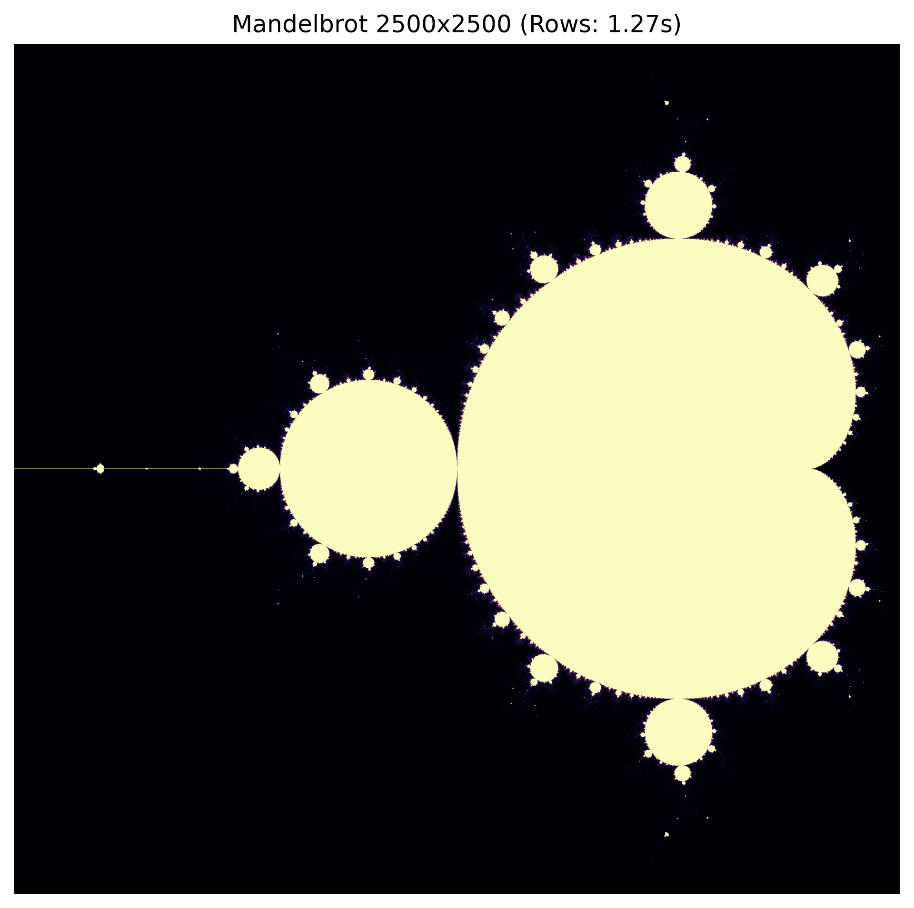

# OpenMP Multi-Core Scaling in Python - completed practicum

**Student:** Abyz Nuradil  
**Student ID:** 230103188  
**Lab date:** 01.10.2026  
**Section:** Not supplied in the assignment request.  
**Benchmark environment:** Automated Linux workspace; not the student laptop  
**Actual run timestamp (UTC):** 2026-10-01T09:53:52.013087+00:00  
**Mode:** full assigned workloads

## Hardware and measurement method

CPU: **AMD EPYC 9V74 80-Core Processor**. Visible logical CPUs: 9; Numba maximum: **9 threads**; container CPU quota: 8 core equivalents. Backend: **omp**. OS: Linux-6.18.44-x86_64-with-glibc2.39. Python 3.12.14; NumPy 2.5.3; Numba 0.68.0; Matplotlib 3.11.2.

Every result is the median of 3 measured repetitions. Each compiled kernel and both heat precisions are warmed up before timing. Heat grids are reset outside each timed region, so every run starts from identical initial conditions. Heat timing includes the Python timestep loop and pointer swaps; Mandelbrot timing includes image allocation. Raw repetition timings and all Monte Carlo estimates are preserved in `benchmark_results.json`.

These measurements describe the environment named above. They do not measure a different laptop. No claim of measured peak RAM bandwidth, SMT effects, or physical-core topology is made from these timings alone.

## Table 1 - Student result scorecard

| Benchmark | Active threads | Size / samples | Time (s) | Speedup | Efficiency (%) |
| --- | ---: | --- | ---: | ---: | ---: |
| Challenge 1: Monte Carlo | 1 | 120,000,000 | 2.180438 | 1.000x | 100.00 |
| Challenge 1: Monte Carlo | 2 | 120,000,000 | 1.451848 | 1.502x | 75.09 |
| Challenge 1: Monte Carlo | 4 | 120,000,000 | 0.777060 | 2.806x | 70.15 |
| Challenge 1: Monte Carlo | 8 | 120,000,000 | 0.418336 | 5.212x | 65.15 |
| Challenge 1: Monte Carlo | 9 | 120,000,000 | 0.377836 | 5.771x | 64.12 |
| Challenge 2: Mandelbrot (rows) | 9 | 2500 x 2500 | 1.272772 | N/A | N/A |
| Challenge 2: Mandelbrot (cols) | 9 | 2500 x 2500 | 1.300855 | N/A | N/A |
| Challenge 3: Heat (float64) | 9 | 1500 x 1500 x 300 | 0.082922 | N/A | N/A |
| Challenge 3: Heat (float32) | 9 | 1500 x 1500 x 300 | 0.067184 | N/A | N/A |

## Challenge 1 - answers A-D

**A. Baseline and maximum-thread runtime.** T_1 = **2.180438 s**. T_max = **0.377836 s** at 9 threads. Maximum-thread speedup is **5.771x**, with **64.12%** efficiency. The best observed speedup is **5.771x** at 9 threads. T_max means runtime at the maximum worker count, not the largest elapsed time.

**B. Why warmup is required.** The first invocation compiles Python into native code, specializes the argument types, and initializes parallel runtime resources. Including that work would compare compilation/startup cost with already compiled executions. The 10,000-sample warmup excludes JIT compilation from the measurements.

**C. Parallel efficiency and Amdahl's Law.** Efficiency decreased below 100% at the maximum worker count: **64.12%**. Speedup S = T_1 / T_p and efficiency E = 100 S / p. Amdahl's Law is S(p) = 1 / (s + (1-s)/p), where s is the serial fraction. Worker coordination, reductions and serial launch overhead limit scaling. CPU quotas and shared execution resources also matter here. On other hardware, memory/cache contention, thermal/frequency changes, and SMT threads sharing physical cores can contribute. Monte Carlo is largely compute-bound, so memory bandwidth is not automatically the dominant explanation. Timing alone does not identify which architectural factor caused a particular loss of efficiency.

**D. Why the count is safe.** Numba recognizes `inside_circle += 1` as an integer sum reduction. Each worker accumulates a private partial count, and those counts are combined after the parallel loop. With OpenMP selected, this has the semantics of `reduction(+:inside_circle)`; workers do not race on an ordinary shared increment. Numba can lower this to private accumulators and a combine phase rather than literal generated C source.

## Challenge 2 - answers A-D

**A. Measured comparison.** Row-parallel time = **1.272772 s**; column-parallel time = **1.300855 s**. The **rows** decomposition was **1.022x** faster in this run. Both output arrays are exactly equal. Changing the decomposition changes both memory access and how expensive pixels are distributed. Contiguous row writes generally favor locality, but workload imbalance can offset that advantage. This run does not separately instrument cache misses or per-thread idle time, so the timing difference is consistent with those factors rather than proof of a single cause.

**B. C-contiguous layout.** A C-order int32 array stores adjacent columns in the same row at consecutive 4-byte addresses. The row kernel varies c inside the inner loop, writing `img[r, c]` contiguously. The column kernel varies r inside the inner loop, also writing `img[r, c]`, but consecutive writes are separated by w * 4 bytes. At width 2500, that stride is 10,000 bytes. Strided writes use cache lines less effectively and can increase cache/TLB pressure. The PDF's `img[c, r]` example illustrates swapped indexing; our actual kernels retain the same coordinate mapping and array indexing.

**C. Load imbalance and dynamic scheduling.** An outer band may escape after a few iterations, while central points reach max_iter. Equal row counts therefore need not mean equal computation. With static contiguous chunks, a worker assigned cheap rows can finish while a worker assigned central rows continues. OpenMP `schedule(dynamic, chunk)` assigns another chunk to each available worker, reducing idle time at the cost of scheduling overhead. A row/column swap by itself does not enable dynamic scheduling. Numba's default `prange` scheduling is static; its positive chunk-size dynamic scheduling is supported by the TBB backend, so changing the chunk size with an OpenMP backend would not demonstrate dynamic scheduling. The recorded backend is **omp**, and these kernels retain default scheduling. See the [official Numba scheduling documentation](https://numba.readthedocs.io/en/stable/user/parallel.html#scheduling).

**D. Visual artifact.** `mandelbrot_output.png` is exported at 300 DPI and accompanies this report and the completed task sheet. The lower image origin matches the coordinates used by the kernel.

## Challenge 3 - answers A-C

**A. Runtime and throughput.** At 9 threads, float64 ran in **0.082922 s**, producing **8140.18 Megacells/s**. Throughput follows the lab formula grid_size^2 * steps / seconds / 1e6. Only (grid_size-2)^2 interior cells are updated at each step; using the full grid is the worksheet's reporting convention.

**B. Float32 comparison.** At the same 9 threads, float32 ran in **0.067184 s**, producing **10047.05 Megacells/s**. The runtime ratio T_float64 / T_float32 = **1.234**; runtime decreased in this measurement. The two buffers occupy **36.00 MB** in float64 and **18.00 MB** in float32. Halving stored element size can reduce data movement and fit more cells in cache. A 2x speedup is not guaranteed because cache reuse, arithmetic, dispatch/synchronization, and CPU quotas also affect total time. The maximum final-state precision difference is **0.00001541 C**, within the checked tolerance. alpha=0.20 satisfies the explicit 2D stability limit alpha <= 0.25. Top and left boundaries remain 100 C; bottom and right remain 0 C except their intersections with the heated walls.

**C. Memory roofline.** The roofline bound is P <= min(P_peak, B * I), where B is memory bandwidth and I is arithmetic intensity (operations per byte moved). This stencil performs relatively little arithmetic for its array traffic. Once the relevant memory bandwidth is saturated, doubling cores cannot double available bytes per second. Cache reuse can shift the relevant bottleneck toward cache bandwidth, and repeated parallel launches add overhead. The scaling tables below show observed runtimes; identifying RAM saturation specifically would require bandwidth or hardware-counter measurements.

### Float64 scaling

| Threads | Time (s) | Speedup | Efficiency (%) | Throughput (Mcells/s) |
| ---: | ---: | ---: | ---: | ---: |
| 1 | 0.473171 | 1.000x | 100.00 | 1426.54 |
| 2 | 0.240758 | 1.965x | 98.27 | 2803.65 |
| 4 | 0.107021 | 4.421x | 110.53 | 6307.20 |
| 8 | 0.087997 | 5.377x | 67.21 | 7670.71 |
| 9 | 0.082922 | 5.706x | 63.40 | 8140.18 |

### Float32 scaling

| Threads | Time (s) | Speedup | Efficiency (%) | Throughput (Mcells/s) |
| ---: | ---: | ---: | ---: | ---: |
| 1 | 0.234506 | 1.000x | 100.00 | 2878.39 |
| 2 | 0.152896 | 1.534x | 76.69 | 4414.75 |
| 4 | 0.112266 | 2.089x | 52.22 | 6012.48 |
| 8 | 0.074270 | 3.157x | 39.47 | 9088.50 |
| 9 | 0.067184 | 3.491x | 38.78 | 10047.05 |

## Validation and leaderboard data

Full-resolution row and column fractals match exactly. Heat grids match exactly across thread counts within each precision; heated and cold boundaries stay fixed, and temperatures remain finite and between 0 and 100 C. Float32 and float64 states agree within the configured tolerance. Monte Carlo estimates are checked against pi using a stochastic tolerance.

Leaderboard entry for this benchmark environment: **AMD EPYC 9V74 80-Core Processor**, Monte Carlo best speedup **5.771x** (9 threads). Best float64 heat speedup: **5.706x**. Record laptop results separately after running on that laptop.
